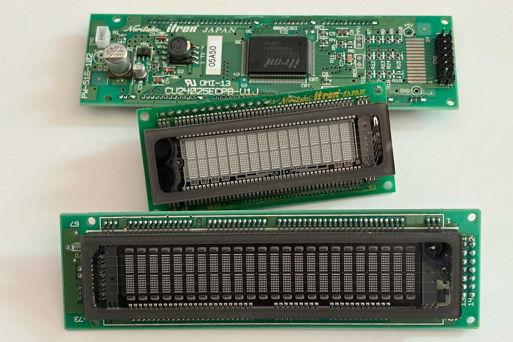
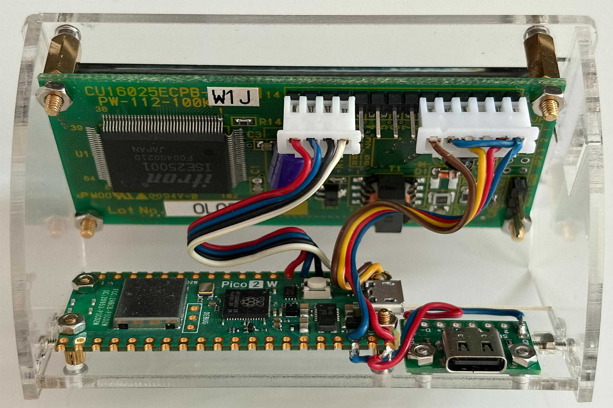
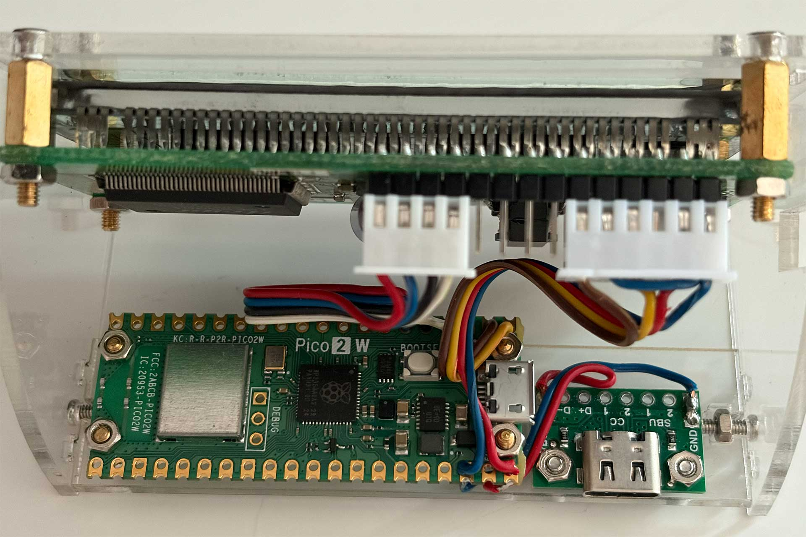
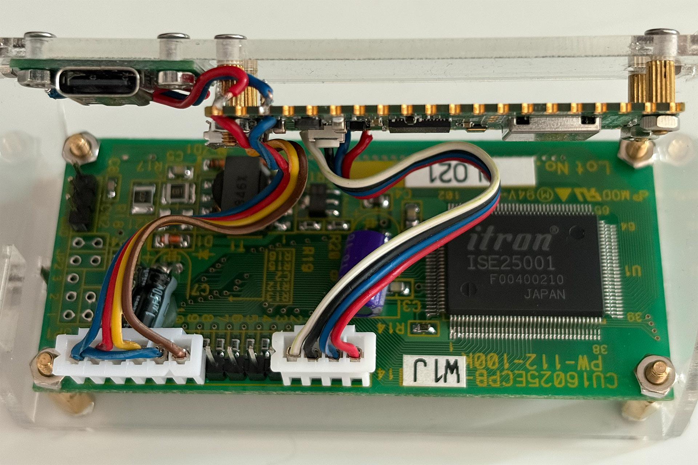
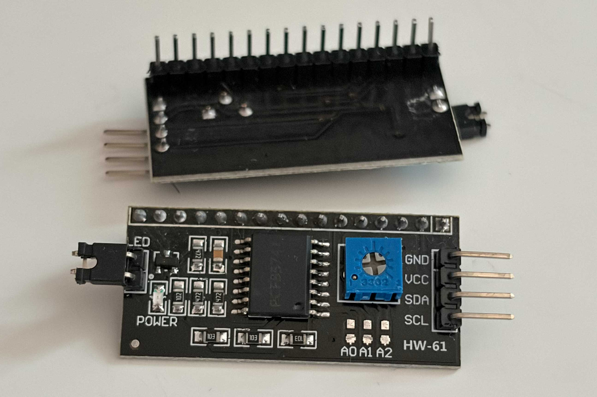
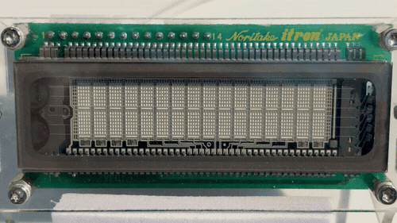
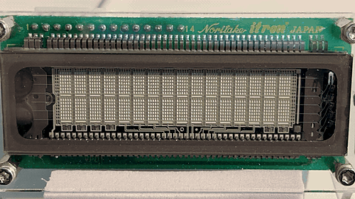

# Noritake Itron CU series VFD driver module

A MicroPython library module for controlling Noritake Itron CU series VFDs,
which are character-based displays.

This library module supports the core command sets of Noritake Itron CU series
VFDs and supports the following models:

- 16x2 Characters – CU16024, CU16025, CU16029
- 20x2 Characters – CU20024, CU20025, CU20027, CU20029
- 20x4 Characters – CU20045, CU20049
- 24x2 Characters – CU24025
- 40x2 Characters – CU40025, CU40026
- 40x4 Characters – CU40045
- 40x6 Characters – CU40066

Note: Models usually include factory suffixes (e.g., -UW1J, -UX3J, or -TW200A)
indicating interface or revision details. All variations of the base models
listed above are fully supported (for example, CU20025-UW1J, CU16024-UX3J,
or CU20029-TW200A).

Here are some examples of supported displays (CU16025 and CU20025):



The library also contains:
- Matrix Rain animation demo
- Digital Clock demo with weather indication.

The library was implemented for MicroPython. However, with a bit of work
it is possible to adapt it for regular Python.

## Connections

You can connect a VFD to your MicroPython board (e.g. Raspberry Pi Pico, ESP32,
etc.) using either a parallel/GPIO connection or an I<sup>2</sup>C connection.

When using a parallel/GPIO connection, you need to import the
`noritake_cu_gpio.py` file. An example of the main script when using parallel/GPIO is shown in the
`main_gpio.py`.

When using an I<sup>2</sup>C connection, you need to import the
`noritake_cu_i2c.py` file. An example of the main script when using I<sup>2</sup>C is shown in the
`main_i2c.py`.

## Parallel/GPIO connection

To connect using parallel/GPIO, connect the VFD directly to the GPIO port
using these cables:

- pin 1 - VSS - Ground
- pin 2 - VDD - 5V
- pin 3 - Contrast - not used by VFDs
- pin 4 - RS (Register Select) - connect to GPIO
- pin 5 - R/W (Read/Write) - connect to ground since the library writes only
- pin 6 - E (Enable) - connect to GPIO
- pins 7-10 - DB (Data Bus) - lower four bits for 8-bit operation, if you are
  using 4-bit mode, then leave these unconnected
- pins 11-14 - DB (Data Bus) - upper four bits for 4-bit or 8-bit communication,
  connected to GPIO

The following picture shows this kind of connection. I have used a Raspberry
Pi Pico 2 W as my board, and I have soldered the VFD directly to the GPIO
pins 0–5. The additional USB-C port is for powering the board so that the 
plug faces out to the back instead of to the left side.



Here is a closer look at the Raspberry Pi Pico 2 W:



And here is the VFD itself:



## I<sup>2</sup>C connection

To connect using I<sup>2</sup>C, you need to use an HD44780 compatible
I<sup>2</sup>C converter like the one shown here:



The converter gets connected to the VFD using its 14-16 pins header.
The 4 pins on the side of the converter connect directly to the GPIO port using these cables:

- pin 1 - GND - Ground
- pin 2 - VCC - 5V
- pin 3 - SDA - I<sup>2</sup>C data line on your Python board
- pin 4 - SCL - I<sup>2</sup>C clock line on your Python board

## Demo scripts

There are two demo scripts that you can run and customize to your needs:
- Matrix Rain animation (`matrix_rain.py`)
- Digital Clock (`clock.py`, `clock_digits.py` and `clock_config.py`)

To test if everything works, you can run the Matrix Rain demo script first
as it has no configuration and does not rely on the internet connection
and third party APIs.

## Matrix Rain animation demo

To run the Matrix Rain animation, you need to make changes in the `main_gpio.py` or
in `main_i2c.py` depending on what connection type you are using.

Adjust the number of lines and columns that your VFD has:
```python
# Define the number of lines and columns in the display.
lines = 2
cols = 16
```

Uncomment the code:
```python
# rain = MatrixRain(vfd, lines, cols)
# rain.animate()
```

Then run the file  
(on a Raspberry Pi Pico you can rename the file to `main.py` so that it runs 
automatically).

You can see the result of working Matrix Rain below  
(actual animation is very smooth, here because of the GIF quality it is not):



### Digital Clock demo

To run the Digital Clock, first you need to make the same changes as explained
in the Matrix Rain animation demo section, except this time you would have
to uncomment the code related to the clock functionality:
```python
# clock = ClockTemp(vfd, lines, cols)
# clock.keepRunning()
```

Then you need to copy `clock_config.py` to `clock_config_local.py` and do
edits in the copy:
- `wifi_ssid` - provide the name of your Wi-Fi network
- `wifi_password` - provide the password to your Wi-Fi network
- `time_api_key` - the system needs to access the timeapi.world API to get the timezone-dependent time
- `time_timezone` - provide the timezone for which to get the time
- `weather_api_key` - the system needs to access the OpenWeatherMap API to get the weather data
- `weather_city` - provide the city for which to show the weather
- `weather_unit` - set either to 'metric' or 'imperial'
- `vfd_dim_hour` - at what hour the VFD should dim because it is early night
- `vfd_off_hour` - at what hour the VFD should turn off because it is late night
- `vfd_on_hour` - at what hour in the morning the VFD should turn on again
- `matrix_rain_duration` - for how long the Matrix Rain animation should show up
  at every full hour. Set to 0 to disable it entirely.

When you edit the configuration, you need to get API keys for timeapi.world and
for OpenWeatherMap. Links are provided in the configuration file. The API
keys are needed so that the clock can retrieve the proper time and weather from
the internet.

Once you configure everything in the config file, then you can run the Python
script the same way as explained in the Matrix Rain demo. If the Wi-Fi and
APIs access worked, then you should see a clock on the left and temperature and
humidity on the right of the screen.

The following picture shows the Digital Clock demo in action:

