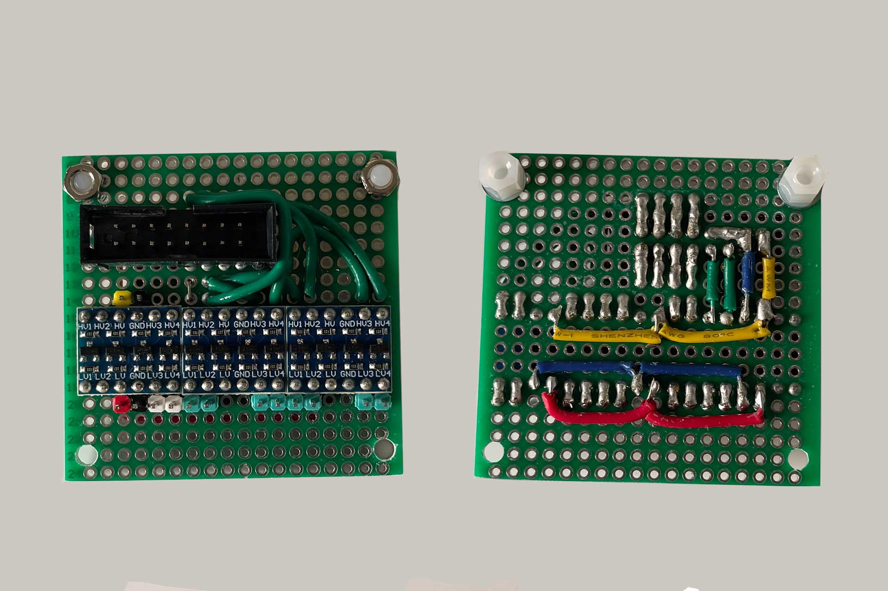
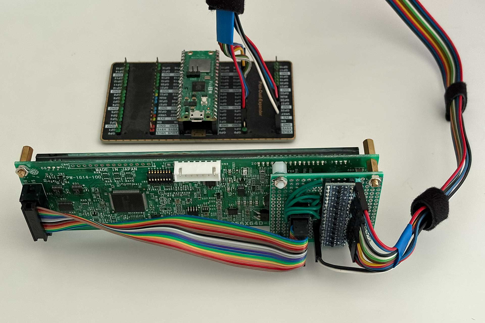
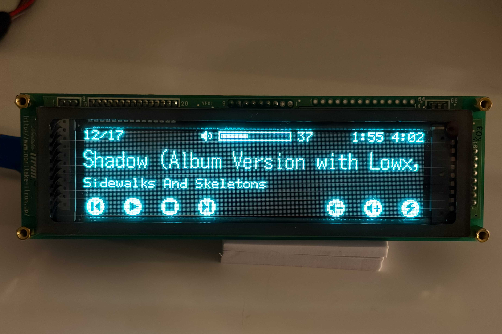
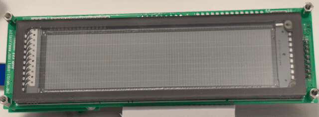

# Noritake Itron GU series VFD driver module

A CPython / MicroPython library module for controlling Noritake Itron GU series
 VFDs, which are graphical displays.

This library module supports many of the core commands of the Noritake Itron
CU series VFDs and supports the following models:

- 112x16 Pixels – GU112X16G
- 128x32 Pixels – GU128X32D
- 128x64 Pixels – GU128X64, GU128X64D, GU128X64F
- 128x128 Pixels - GU128X128D
- 256x32 Pixels - GU256X32D
- 256x64 Pixels – GU256X64C, GU256X64D, GU256X64E, GU256X64F
- 256x128 Pixels – GU256X128C, GU256X128D, GU256X128E
- 384x32 Pixels – GU384X32L
- 512x32 Pixels - GU512X32H

Note: Models usually include factory suffixes (e.g., '-3900B')
indicating interface or revision details. All variations of the base models
listed above are fully supported (for example, GU256X64D-3900B).

Here is an example supported display (GU256x64D):

The Gu series module contains:
- An API to interact with the VFD
- A parallel connection class for connecting via parallel (not needed for
  serial connection)
- A Hi-Fi network player screen demo
- Readme file with detailed information.

## Connections

You can connect a VFD to your CPython Raspberry Pi computer or to MicroPython
board (e.g., Raspberry Pi Pico, ESP32, etc.) using either a parallel or serial
connection.

Parallel connection is recommended for the GU series because it
allows transferring data 8-times faster than the serial connections. In
many situations this is needed for a proper display performance.

As far as I know, the GU series models have a capability of both connections.
The ports on the VFD board typically look as follows:

### Ports comparison:

- Serial port - only 4 cables needed, but is much slower. 2 cables are for powering up and 2 for data.
- Parallel port - the port here has 16 pins and 16 cables are needed.
  6 cables are for powering up (2x 5V cable + 4x Ground cable). The reason for
  duplicated power cables is their small diameter when a ribbon cable is used.
  Multiple ground cables are used for signal shielding, and they need to be
  connected. The remaining cables are for data and control signals.

Regarding the mentioned parallel connection ribbon cable - its easy to buy
or make one. The one that I have used I have made myself at a length that
I needed. It looked as follows:

When using serial connection simply use `noritake_gu.py`.

When using parallel connection you also need to import the
`noritake_gu_parallel_cpython.py` or the `noritake_gu_parallel_micropython.py`
depending on which language you are developing in. Both CPython and
MicroPython are supported.

## Voltage level shifter

The VFD communicates using 5V signals while the Raspberry Pi Pico, which I
have used for testing, and later the Raspberry Pi 5, which I have used in the
actual project,  both use 3.3 voltage level in their GPIOs.

For this reason I have used a custom-made voltage level shifter board, so
that 5V from the VFD do not break the Raspberry. The 5V to 3.3V level shifting
board looked as follows:

On one end there is a 16-pin ribbon cable socket which connects to the VFD at 5V
level. On the other side there are pins which I connect to the GPIO at 3.3V.

Remember to never connect 5V signals to 3.3V GPIO unless you are very sure
that your Raspberry is only sending signals, while the 5V device never sends
any.

## Serial connection

The serial connection port is easier to use, so I am explaining it first.

The physical port has 7 pins. They are:

- pin 1 - RDX - Receive data
- pin 2 - DTR - Data terminal ready
- pin 3 - DSR - Data set ready
- pin 4 - TXD - Transmit data
- pin 5 - NC - No connection
- pin 6 - VCC - 5V
- pin 7 - GND - Ground

For the serial connection to work you need pins 1, 4, 6 and 7 connected to
your boards serial IO and power.

This connection type is not recommended as it is slow. You can use it
if you are not sending lots of data to the display.

## Parallel connection

The parallel connection requires more work but is much better and faster.
I used it for my project to update the display quickly.

The downside is more cables.

The physical parallel port on the GU256X64D-3900B, which I have used, 
has many pins, aligned in two rows:

- pin 1 - D7 - Data bit 7
- pin 2 - D6 - Data bit 6
- pin 3 - D5 - Data bit 5
- pin 4 - D4 - Data bit 4
- pin 5 - D3 - Data bit 3
- pin 6 - D2 - Data bit 2
- pin 7 - D1 - Data bit 1
- pin 8 - D0 - Data bit 0
- pin 9 - GND - Ground
- pin 10 - WR - Data Write
- pin 11 - GND - Ground
- pin 12 - RDY - Display Ready
- pin 13 - GND - Ground
- pin 14 - GND - Ground
- pin 15 - VCC - 5V
- pin 16 - VCC - 5V

For other models the pins should be similar, but they might have different
positions. Always consult the manuals of the VFD that you have.

The following photo show the completed parallel connection with custom voltage
level shifter. Behind the VFD there is a Raspberry Pi Pico to which everything
is connected.

## Demo scripts

There is a single demo script that your can run and customize to your needs:
- Network Media Player Display (`hifi_display.py` and `hifi_display_icons.py`)

## Network player VFD display

I have used the Noritake Itron GU256X64D 3900B as a display for my network
music player, supporting AirPlay and Bluetooth. I am including the files
used to drive the players VFD here as a demo.

It requires the following files:

- `noritake_gu.py` - The main Noritake GU Series driver
- `noritake_gu_parallel_cpython.py` - Parallel connection CPython class
- `noritake_gu_parallel_micropython.py` - Parallel connection MicroPython class
- `hifi_display.py` - The main Hi-FI VFD commands pack/library
- `hifi_display_icons.py` - File containing encoded images that are being
  printed on the display
- `main_cpython.py` - This file shows to use the Hi-Fi commands pack.
- `main_micropython.py` - This file shows to use the Hi-Fi commands pack.

Simply pick your language (CPython or MicroPython) and use corresponding
Python files.

Each main_ file contains code for both serial and parallel
connection. When you run the right main_ file, the screen should show
network players UI on the screen.

The following picture shows the Hi-Fi script in action:

Here is also lowered quality GIF, so that it loads faster - the actual VFD
looks very smooth and has no issues, no moving stripes or glitches:

