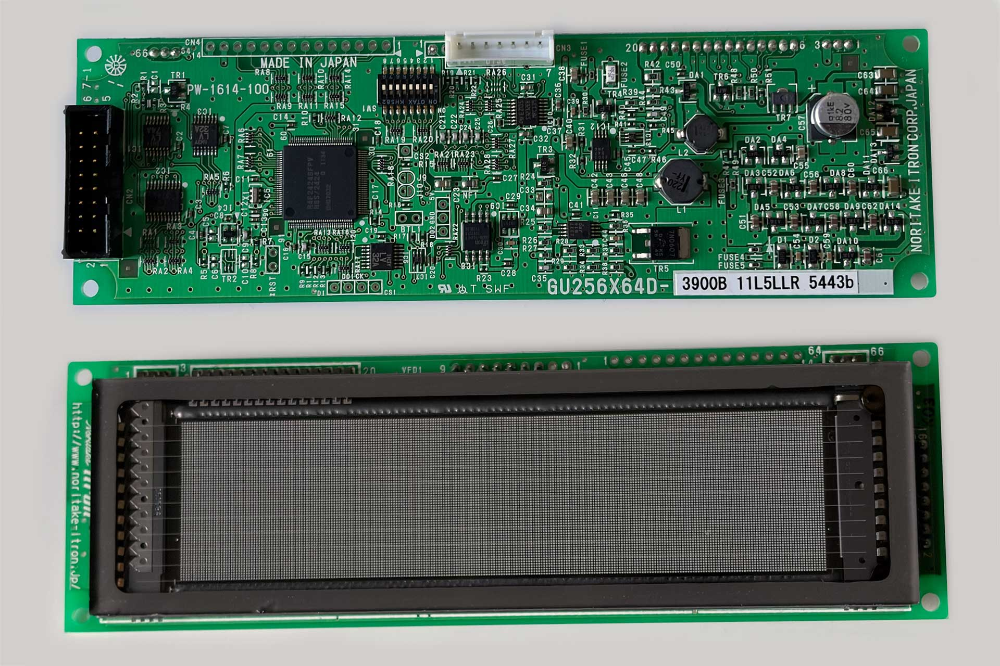
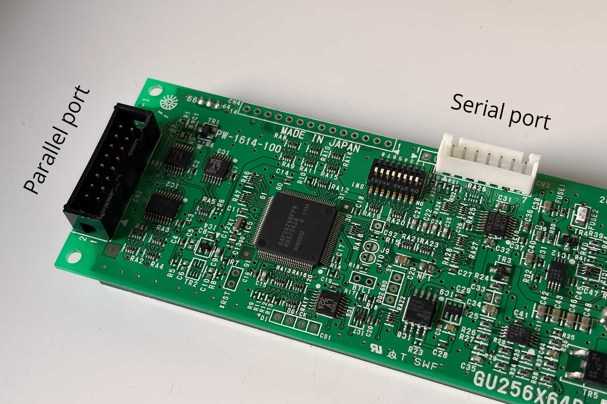
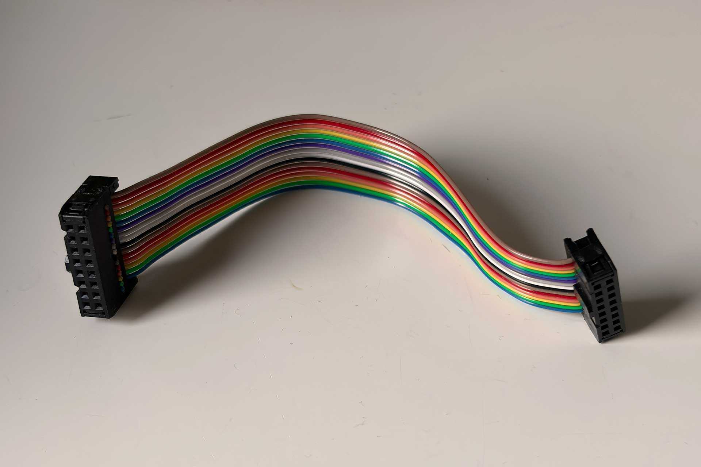

# Noritake Itron GU series VFD driver module

A CPython / MicroPython library module for controlling Noritake Itron GU series
 VFDs, which are graphical displays.

This library module supports many of the core commands of the Noritake Itron
CU series VFDs and supports the following models:

- 112x16 Pixels – GU112X16G
- 128x32 Pixels – GU128X32D
- 128x64 Pixels – GU128X64, GU128X64D, GU128X64F
- 256x64 Pixels – GU256X64C, GU256X64D, GU256X64E, GU256X64F
- 256x128 Pixels – GU256X128C, GU256X128D, GU256X128E
- 384x32 Pixels – GU384X32L

Note: Models usually include factory suffixes (e.g., 3900B)
indicating interface or revision details. All variations of the base models
listed above are fully supported (for example, GU256X64D 3900B).

Here is an example supported display (GU256x64D):

The Gu series module contains:
- An API to interact with the VFD
- A parallel connection class for connecting via parallel (not needed for
  serial connection)
- A Hi-Fi network player screen demo
- Readme file with detailed information.

## Connections

You can connect a VFD to your CPython Raspberry Pi computer or to MicroPython
board (e.g., Raspberry Pi Pico, ESP32, etc.) using either a parallel or serial
connection.

Parallel connection is recommended for the GU series because it
allows transferring data 8-times faster than the serial connections. In
many situations this is needed for a proper display performance.

As far as I know, the GU series models have a capability of both connections.
The ports on the VFD board typically look as follows:

### Ports comparison:

- Serial port - only 4 cables needed, but is much slower. 2 cables are for powering up and 2 for data.
- Parallel port - the port here has 16 pins and 16 cables are needed.
  6 cables are for powering up (2x 5V cable + 4x Ground cable). The reason for
  duplicated power cables is their small diameter when a ribbon cable is used.
  Multiple ground cables are used for signal shielding, and they need to be
  connected. The remaining cables are for data and control signals.

Regarding the mentioned parallel connection ribbon cable - its easy to buy
or make one. The one that I have used I have made myself at a length that
I needed. It looked as follows:

When using serial connection simply use `noritake_gu.py`.

When using parallel connection you also need to import the
`noritake_gu_parallel_cpython.py` or the `noritake_gu_parallel_micropython.py`
depending on which language you are developing in. Both CPython and
MicroPython are supported.

## Voltage level shifter

## Serial connection

## Parallel connection

## Demo scripts

I have used the Noritake Itron GU256X64D 3900B as a display for my network
music player, supporting AirPlay and Bluetooth. I am including the files
used to drive the players VFD here as a demo.

The files needed are:

- `noritake_gu.py`
- `noritake_gu_parallel_cpython.py`
- `hifi_display.py`
- `hifi_display_icons.py`
- `main_cpython.py` (to test things out)

## Network player VFD display

